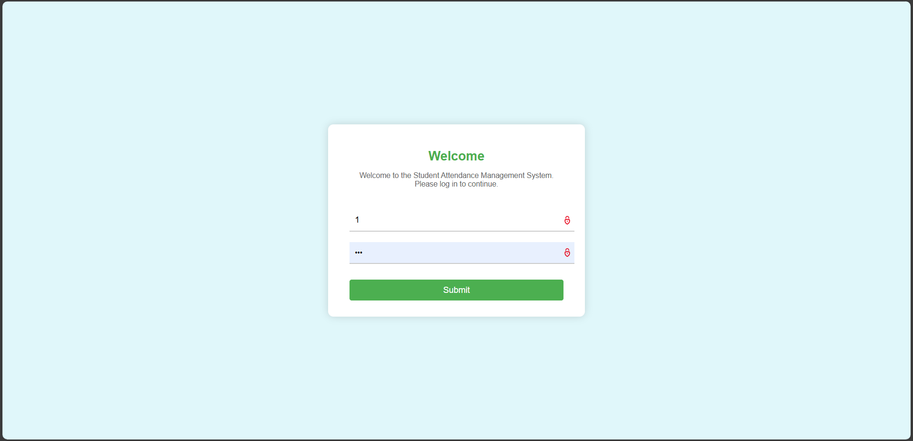
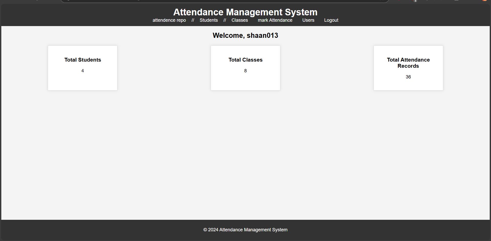
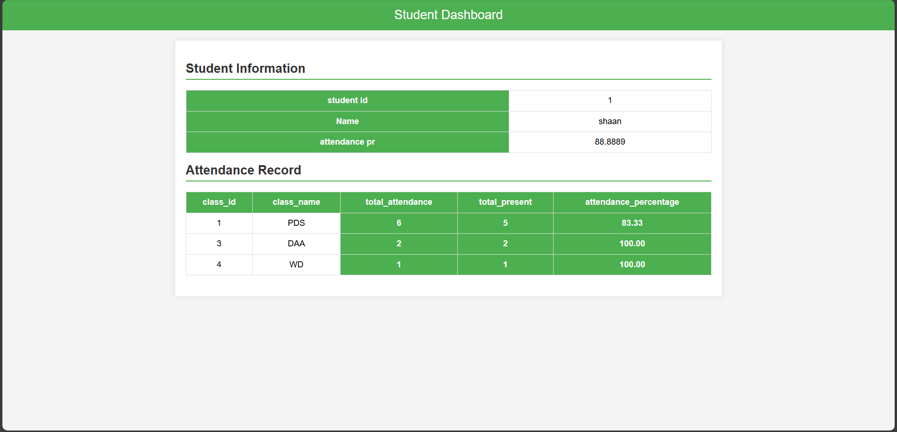
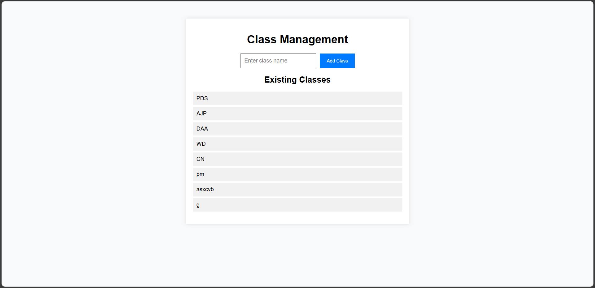
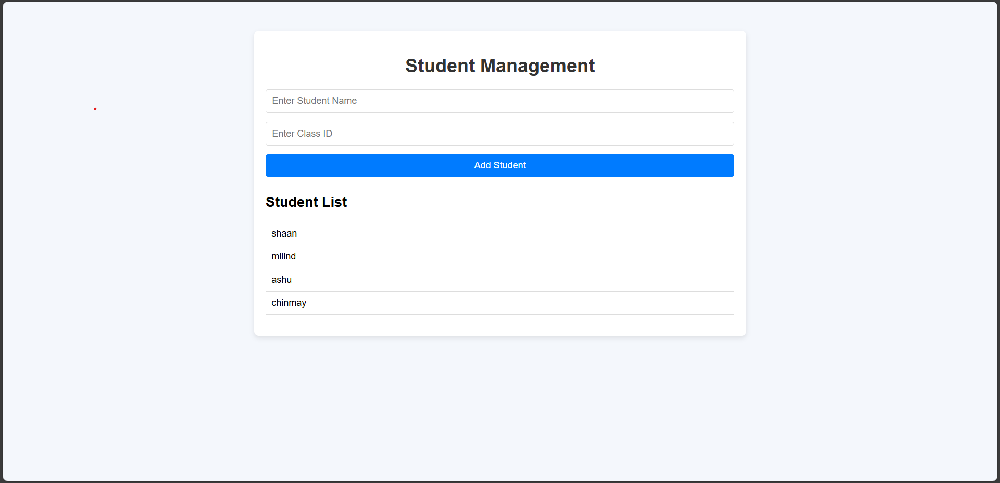
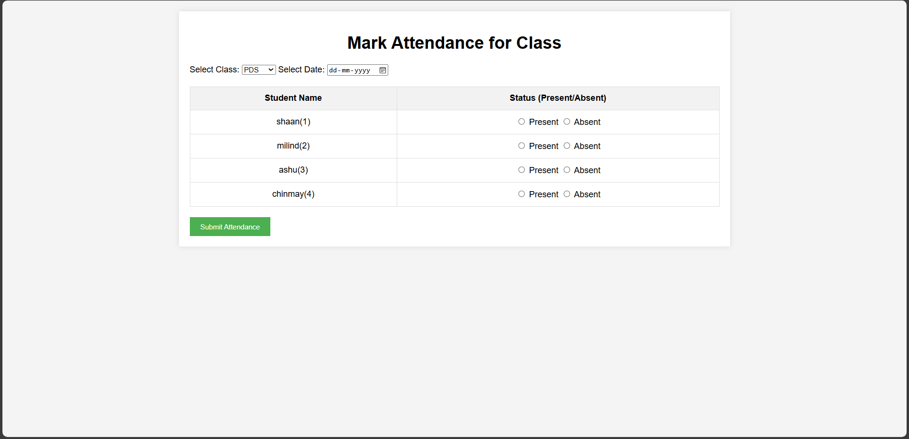
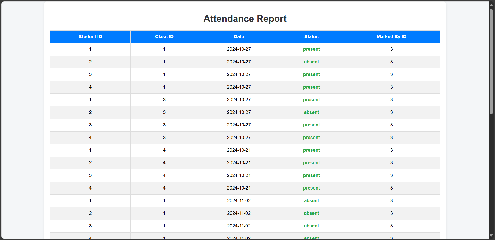

---

# 📘 Student Attendance Management System  

Welcome to the **Student Attendance Management System** project! This application simplifies attendance tracking and management for students, professors, and administrators in educational institutions.  

## 🚀 Version  

**Current Version:** 1.0.0  

## 🛠 Features  

- **🌟 User Authentication:** Secure login/logout for admins, professors, and students.  
- **📝 Attendance Management:** Mark, update, and preview attendance records.  
- **📊 Reports & Analytics:** Generate attendance percentages by subject and class.  
- **🔍 User Roles:** Admins manage users and classes, while professors mark attendance.  
- **📁 Database Integration:** Efficient management of student, class, and attendance data.  

## 🖼 Screenshots  

Below are some images showcasing the application interface:

**Login Page**  
  

**admin Dashboard**  


**student Dashboard**  


**add class**


**add student**


**Attendance marking**  
  

**Attendance Preview**  
  

## 📋 Prerequisites  

### Software Requirements:  

- Java Development Kit (JDK 8+)  
- Apache Tomcat Server (v10.x)  
- MySQL Database  
- NetBeans IDE (or any Java-compatible IDE)  

### Database Setup:  

Ensure you update the following credentials in the project files:  

- Email ID  
- Email Password  
- Database URL  
- Database Username  
- Database Password  

## 💻 Deployment Steps  

### 1. Clone the Repository  
```bash  
git clone https://github.com/Shaan013/Student-Attendance-Management-System  
```  

### 2. Import the Project into NetBeans  

1. Open **NetBeans IDE**.  
2. Go to **File > Open Project**.  
3. Navigate to the folder where you cloned the repository and select the project folder.  
4. Click **Open Project**.  

### 3. Configure the Database  

1. Open the `SQL` file provided in the **resources/** folder.  
2. Use **MySQL Workbench**, **phpMyAdmin**, or the **MySQL Command Line Client** to execute the script and create the required database and tables.  
3. Locate the database configuration file in your project (likely in the `src/main/java/dao` folder or a `.properties` file).  
4. Update the database credentials with your MySQL details:  
   - Database URL  
   - Username  
   - Password  

### 4. Set Up the Apache Tomcat Server  

1. Open **NetBeans** and go to **Tools > Servers**.  
2. Click **Add Server**.  
3. Select **Apache Tomcat** and click **Next**.  
4. Provide the location of your Tomcat installation directory.  
5. Click **Finish** to add the server.  

### 5. Build and Deploy the Application  

1. Right-click the project name in the **Projects** tab of NetBeans.  
2. Select **Clean and Build** to compile the project and prepare it for deployment.  
3. Once the build is successful, right-click the project again and choose **Run**.  
4. NetBeans will deploy the project to the configured Apache Tomcat server.  

### 6. Access the Application  

1. Open your web browser.  
2. Navigate to:  
   ```  
   http://localhost:8080/StudentAttendanceManagement  
   ```  

### 7. Testing the Application  

- Test the login functionality for different roles (Admin, Professor, Student).  
- Check the attendance management and report generation features.  

## 🌐 Suggestions for Efficient Deployment in NetBeans  

1. **Database Integration in NetBeans:** Use the **Services** tab in NetBeans to connect directly to your MySQL database. This makes it easier to test queries and manage data without leaving the IDE.  
2. **Log Viewer:** Use the Tomcat server logs in NetBeans to troubleshoot deployment issues.  
3. **Debugging:** Run the project in **Debug Mode** to step through your code and identify errors.  
4. **Dependencies Management:** Ensure all required libraries (e.g., JDBC driver) are added to the project via the **Libraries** section.  

## 📂 Folder Structure  

- **src/main/java**  
  - **dao/**         # Database Access Objects  
  - **model/**       # Data Models  
  - **servlet/**     # Servlets for business logic  
- **src/main/webapp**  
  - **css/**         # Styling files  
  - **js/**          # JavaScript files  
  - **jsp/**         # JSP pages  
- **resources/**     # SQL schema and configuration files  

## ✨ Highlights  

- **Minimalistic Design:** Simple and intuitive user interface.  
- **Efficient Data Handling:** Uses optimized queries for data operations.  
- **Customizable:** Easily adaptable to different institutions or requirements.  

## 🛡 Security  

- **Session Management:** Ensures secure login/logout.  
- **Sensitive Data Handling:** Proper encryption and handling of passwords and other sensitive data.  

## 🌐 Technologies and Languages Used  

- **Java:** Backend logic and business processing.  
- **JSP (JavaServer Pages):** Dynamic content rendering for web pages.  
- **Servlets:** Managing backend requests and responses.  
- **JDBC (Java Database Connectivity):** Database communication and operations.  
- **MySQL:** Database for managing student, attendance, and class data.  
- **HTML5:** Structuring the frontend pages.  
- **CSS3:** Styling and designing the frontend.  
- **JavaScript:** Adding interactivity to web pages.  
- **Apache Tomcat:** Deployment server for the project.  
- **NetBeans IDE:** Development environment for coding.  
- **Git:** Version control for managing the codebase.  

## 📜 License  

This project is licensed under the MIT License. See the LICENSE file for details.  

## 👥 Contributors  

Developer - Shaan Patel

## 📧 Support  

For any issues, please contact [shaanpatel013@gmail.com].  

## 📝 Attachments  

- **SQL** - Database schema file  

---
